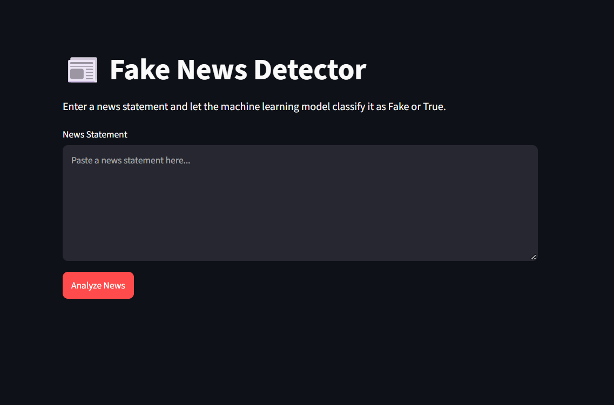
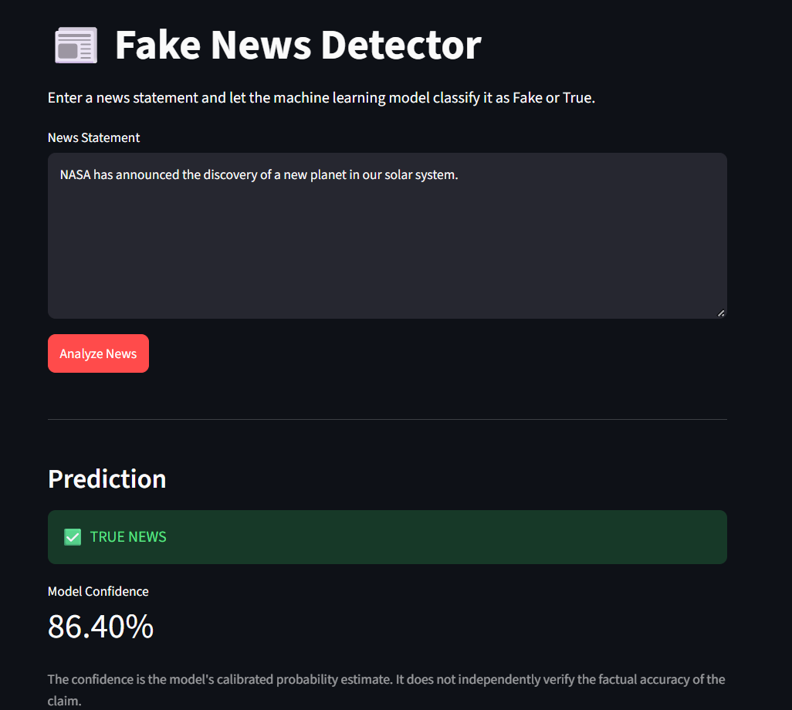
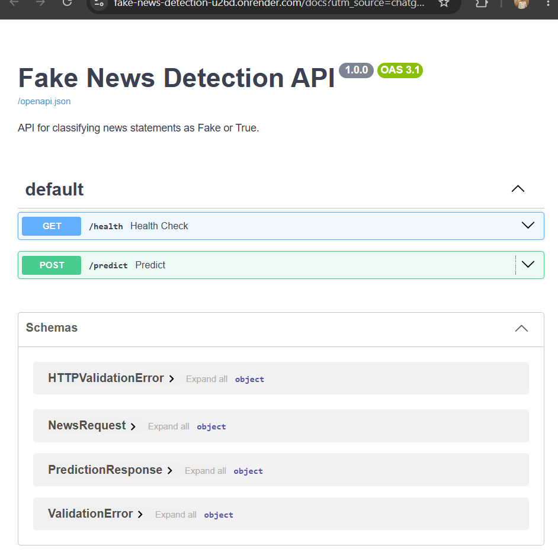
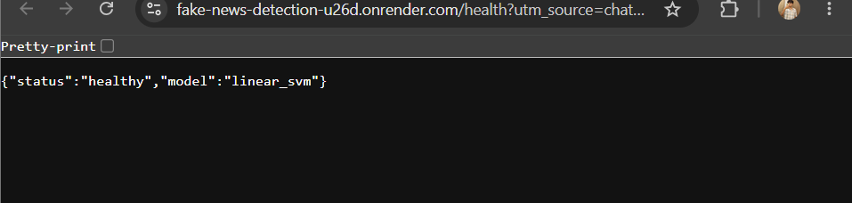
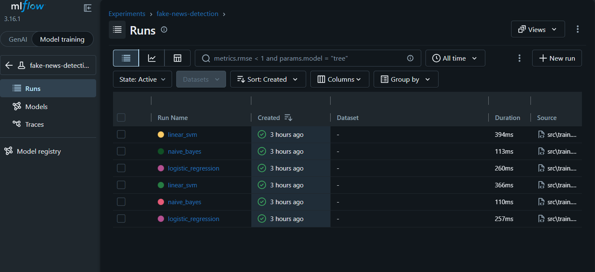
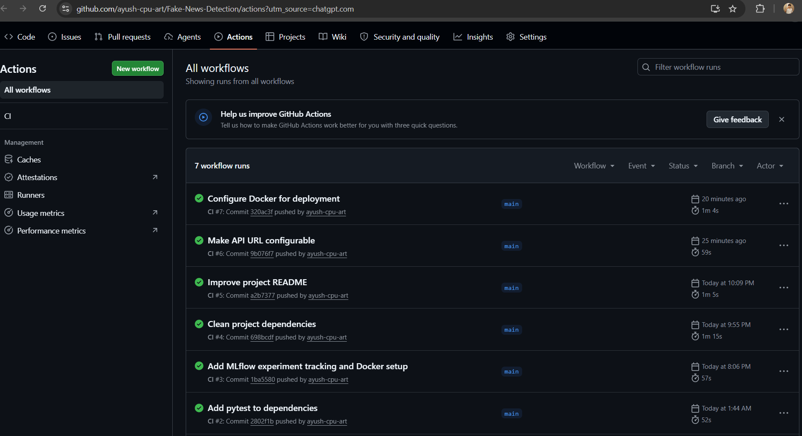

#  Fake News Detection

An end-to-end Machine Learning and MLOps project for classifying news statements as **Fake** or **True** using TF-IDF feature extraction and multiple machine learning models.

The project includes model training, experiment tracking with MLflow, a FastAPI inference API, a Streamlit frontend, automated testing, Docker containerization, and GitHub Actions CI.

---

##  Features

-  Data preprocessing and text cleaning
-  TF-IDF feature engineering with unigram and bigram features
-  Multiple ML models:
  - Logistic Regression
  - Multinomial Naive Bayes
  - Calibrated Linear SVM
-  Model evaluation using:
  - Accuracy
  - Precision
  - Recall
  - F1-score
-  MLflow experiment tracking
-  MLflow model artifact tracking
-  FastAPI REST API
-  Streamlit web interface
-  Docker containerization
-  Docker Compose
-  Pytest automated testing
-  GitHub Actions CI
-  Modular project structure

---

##  Machine Learning Pipeline

```text
Raw News Dataset

       ↓

Data Cleaning

       ↓

Remove Conflicting Labels

       ↓

Duplicate Removal

       ↓

Train/Test Split

       ↓

TF-IDF Vectorization

       ↓

┌──────────────────────────────┐
│ Logistic Regression          │
│ Multinomial Naive Bayes      │
│ Calibrated Linear SVM        │
└──────────────────────────────┘

       ↓

Model Evaluation

       ↓

MLflow Experiment Tracking

       ↓

Saved Model + Vectorizer

       ↓

FastAPI Inference API

       ↓

Docker Container

       ↓

Streamlit Frontend
```

---

##  Dataset

This project uses the **IFND (Indian Fake News Dataset)** containing news statements labeled as either **True** or **Fake**.

### Dataset Statistics

| Metric | Value |
|---|---:|
| Original records | 56,714 |
| Processed records | 55,977 |
| Conflicting-label statements removed | 363 |
| Final True samples | 37,437 |
| Final Fake samples | 18,540 |

### Preprocessing

The following preprocessing steps were applied:

- Converted text to lowercase
- Removed URLs
- Removed HTML tags
- Removed special characters and numbers
- Normalized whitespace
- Removed statements with conflicting labels
- Removed duplicate statements
- Converted labels:
  - `TRUE → 1`
  - `Fake → 0`

The raw dataset is preserved in `data/raw/`, while the cleaned dataset is stored in `data/processed/`.

---

## 🔤 Feature Engineering

TF-IDF (Term Frequency–Inverse Document Frequency) was used to convert news statements into numerical feature vectors.

### TF-IDF Configuration

| Parameter | Value |
|---|---|
| Maximum features | 10,000 |
| Stop words | English |
| N-grams | Unigrams + Bigrams |
| Minimum document frequency | 2 |
| Maximum document frequency | 0.95 |
| Sublinear TF | Enabled |

The resulting feature matrices were:

- Training set: `44,781 × 10,000`
- Testing set: `11,196 × 10,000`

The fitted TF-IDF vectorizer is saved as:

```text
models/tfidf_vectorizer.pkl
```

---

##  Model Training & Results

Three machine learning models were trained and evaluated using the TF-IDF feature representation.

| Model | Accuracy | Macro F1-Score |
|---|---:|---:|
| Logistic Regression | 95.10% | 94% |
| Multinomial Naive Bayes | 94.69% | 94% |
| Calibrated Linear SVM | **95.92%** | **95%** |

### Classification Performance

The **Calibrated Linear SVM** achieved an accuracy of **95.92%** on the held-out test set.

| Class | Precision | Recall | F1-Score |
|---|---:|---:|---:|
| Fake | 0.97 | 0.91 | 0.94 |
| True | 0.96 | 0.99 | 0.97 |
| Macro Average | 0.96 | 0.95 | 0.95 |
| Weighted Average | 0.96 | 0.96 | 0.96 |

The Calibrated Linear SVM is used as the inference model in the FastAPI application.

The trained models are stored in:

```text
models/
├── logistic_regression.pkl
├── naive_bayes.pkl
└── linear_svm.pkl
```

The Linear SVM uses `CalibratedClassifierCV`, allowing the API to return a calibrated probability estimate alongside each prediction.

---

##  MLflow Experiment Tracking

MLflow is used to track machine learning experiments, parameters, metrics, training time, and model artifacts.

### Tracked Parameters

- Model type
- TF-IDF maximum features
- N-gram range
- Minimum document frequency
- Maximum document frequency
- Training and testing dataset sizes

### Tracked Metrics

- Accuracy
- Weighted Precision
- Weighted Recall
- Weighted F1-score
- Training time

The experiment is stored under:

```text
fake-news-detection
```

MLflow uses a SQLite backend for experiment tracking:

```text
mlflow.db
```

Model artifacts are logged for each trained model, making it possible to compare experiments and inspect saved models through the MLflow UI.

---

##  FastAPI Inference API

The trained Calibrated Linear SVM model is exposed through a REST API built with FastAPI.

### API Endpoints

| Method | Endpoint | Description |
|---|---|---|
| GET | `/health` | Check API and model status |
| POST | `/predict` | Classify a news statement |

### Prediction Request

```json
{
  "text": "News statement to classify"
}
```

### Prediction Response

```json
{
  "prediction": "True",
  "confidence": 0.92
}
```

The `/predict` endpoint:

1. Accepts a news statement.
2. Transforms the text using the saved TF-IDF vectorizer.
3. Passes the transformed text to the trained model.
4. Returns the predicted label.
5. Returns the model's calibrated confidence estimate.

### Running the API

```bash
uvicorn api.main:app --reload
```

The API will be available at:

```text
http://127.0.0.1:8000
```

Interactive API documentation:

```text
http://127.0.0.1:8000/docs
```

> **Note:** The confidence score represents the model's calibrated probability estimate based on patterns learned from the training dataset. It does not independently verify the factual accuracy of a news claim.

---

##  Streamlit Frontend

A Streamlit web interface provides a simple way for users to interact with the Fake News Detection API.

### Features

-  News statement input
-  One-click prediction
-  Fake / True classification
-  Model confidence display
-  FastAPI backend integration
-  API connection error handling

### Running the Frontend

```bash
streamlit run frontend/app.py
```

The application will be available at:

```text
http://localhost:8501
```

The frontend sends the entered news statement to the FastAPI `/predict` endpoint and displays the returned prediction and confidence score.

> **Note:** The displayed confidence is the model's calibrated probability estimate. It should not be interpreted as independent fact verification.

---

## 📸 Screenshots

### Streamlit Home Page



### Prediction Result



### FastAPI Swagger Documentation



### API Health Check



### MLflow Experiment Tracking



### GitHub Actions



---

##  Docker & Docker Compose

The FastAPI application is containerized using Docker to provide a consistent and reproducible runtime environment.

### Docker

The Docker image:

- Uses Python 3.13
- Installs project dependencies from `requirements.txt`
- Copies the API source code and trained models
- Exposes port `8000`
- Runs the FastAPI application using Uvicorn

Build the Docker image:

```bash
docker build -t fake-news-api .
```

Run the container:

```bash
docker run -p 8000:8000 fake-news-api
```

The API will then be available at:

```text
http://localhost:8000
```

### Docker Compose

Docker Compose is also provided for easier container management.

Start the application:

```bash
docker compose up --build
```

Stop the application:

```bash
docker compose down
```

---

##  Testing & Continuous Integration

The project includes automated tests to validate both the preprocessing pipeline and FastAPI endpoints.

### Pytest

Tests cover:

- Text cleaning
- Dataset preprocessing
- API health check
- Prediction endpoint
- Empty input validation

Run the test suite with:

```bash
pytest
```

Current test result:

```text
5 passed
```

### GitHub Actions

GitHub Actions is configured to automatically run the test suite whenever changes are pushed to the repository.

The CI workflow:

1. Checks out the repository
2. Sets up Python
3. Installs project dependencies
4. Runs Pytest
5. Reports the test result

Workflow configuration:

```text
.github/workflows/ci.yml
```

This helps ensure that new changes do not break existing functionality.

---

##  Project Structure

```text
Fake News Detection/
│
├── .github/
│   └── workflows/
│       └── ci.yml
│
├── api/
│   ├── __init__.py
│   ├── main.py
│   └── schemas.py
│
├── data/
│   ├── raw/
│   │   └── IFND.csv
│   └── processed/
│       └── cleaned_data.csv
│
├── frontend/
│   └── app.py
│
├── models/
│   ├── linear_svm.pkl
│   ├── logistic_regression.pkl
│   ├── naive_bayes.pkl
│   └── tfidf_vectorizer.pkl
│
├── notebooks/
│   ├── eda.ipynb
│   ├── preprocessing.ipynb
│   └── model_training.ipynb
│
├── screenshots/
│   ├── api-health.png
│   ├── fastapi-swagger.png
│   ├── github-actions.png
│   ├── home-page.png
│   ├── mlflow.png
│   └── prediction.png
│
├── src/
│   ├── __init__.py
│   ├── data_preprocessing.py
│   ├── feature_engineering.py
│   ├── train.py
│   ├── evaluate.py
│   └── predict.py
│
├── tests/
│   ├── test_api.py
│   └── test_preprocessing.py
│
├── pytest.ini
├── Dockerfile
├── docker-compose.yml
├── requirements.txt
└── README.md
```

### Directory Overview

| Directory / File | Purpose |
|---|---|
| `api/` | FastAPI application and request/response schemas |
| `data/` | Raw and processed datasets |
| `frontend/` | Streamlit user interface |
| `models/` | Trained ML models and TF-IDF vectorizer |
| `notebooks/` | Exploratory analysis and experimentation |
| `screenshots/` | Project screenshots and demonstrations |
| `src/` | Core preprocessing, training, evaluation, and prediction logic |
| `tests/` | Automated unit and API tests |
| `.github/workflows/` | GitHub Actions CI configuration |
| `Dockerfile` | Docker image configuration |
| `docker-compose.yml` | Docker Compose configuration |
| `requirements.txt` | Python dependencies |
| `pytest.ini` | Pytest configuration |

---

##  Installation & Usage

### 1. Clone the Repository

```bash
git clone https://github.com/ayush-cpu-art/Fake-News-Detection.git

cd Fake-News-Detection
```

### 2. Create a Virtual Environment

#### Windows

```bash
python -m venv .venv

.venv\Scripts\activate
```

#### Linux / macOS

```bash
python3 -m venv .venv

source .venv/bin/activate
```

### 3. Install Dependencies

```bash
pip install -r requirements.txt
```

### 4. Run the FastAPI Backend

```bash
uvicorn api.main:app --reload
```

API:

```text
http://127.0.0.1:8000
```

Swagger documentation:

```text
http://127.0.0.1:8000/docs
```

### 5. Run the Streamlit Frontend

Open another terminal, activate the virtual environment, and run:

```bash
streamlit run frontend/app.py
```

Frontend:

```text
http://localhost:8501
```

### 6. Run Tests

```bash
pytest
```

### 7. Run with Docker

Build the image:

```bash
docker build -t fake-news-api .
```

Run the container:

```bash
docker run -p 8000:8000 fake-news-api
```

Or use Docker Compose:

```bash
docker compose up --build
```

Stop the containers:

```bash
docker compose down
```

---

##  Limitations

- The model classifies news based on linguistic and statistical patterns learned from the IFND dataset.
- It does not independently verify claims against external sources or fact-checking databases.
- Model performance may vary on news topics, writing styles, or sources that differ from the training data.
- The dataset contains an imbalance between True and Fake samples.
- The confidence score represents the model's calibrated probability estimate and should not be interpreted as factual certainty.

---

##  Future Improvements

Possible improvements include:

-  Integrate external fact-checking and web retrieval
-  Experiment with transformer-based models such as BERT
-  Implement Retrieval-Augmented Generation (RAG) for evidence retrieval
-  Add model performance monitoring
-  Implement automated model retraining
-  Add dataset and model versioning
-  Deploy the API and frontend to cloud infrastructure
-  Add authentication and API security
-  Add production monitoring and logging
-  Expand test coverage and integration tests

---

##  Tech Stack

### Programming Language

- Python

### Machine Learning

- Scikit-learn
- NumPy
- Pandas
- SciPy
- Joblib

### NLP

- TF-IDF Vectorization
- N-gram feature extraction
- Text preprocessing

### MLOps

- MLflow
- Model artifact tracking
- Experiment tracking

### Backend

- FastAPI
- Uvicorn
- Pydantic

### Frontend

- Streamlit

### Testing

- Pytest
- HTTPX

### DevOps

- Docker
- Docker Compose
- GitHub Actions

### Development Tools

- VS Code
- Git
- GitHub

---

##  Author

**Ayush Dev**

B.Tech Computer Science & Engineering — AI & ML

Interested in **Machine Learning, MLOps, AI, and Software Development**.

- GitHub: https://github.com/ayush-cpu-art
- Email: ayushdev0408@gmail.com

---

##  License

This project is intended for educational and portfolio purposes.